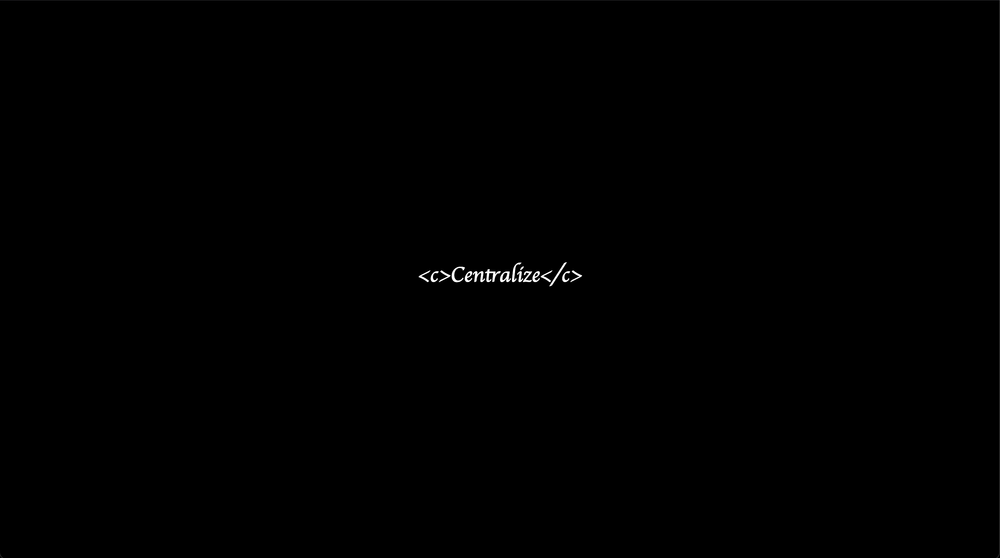
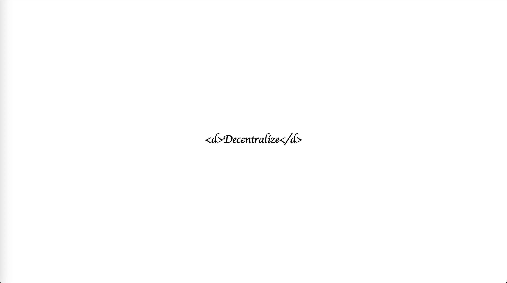

# About 
centralize-decenralize (2024) explores the paradox of decentralization

When auto-proclaimed "decentralized" applications are hosted on mega-coroporation controlled servers, are they really "decentralized"? 

When decentralized entities explore different ways of creating networks, perhaps through local first software and "decentralized internets", why should they as a structural entity exist if not to centralize their existence?

# How to 
This piece has two modes of existence: 
- In a local execution space the html language prompts the user to "centralize" 
- In a networked execution space the html language prompts the user to "decentralize" 

This piece currently does not have an existence on the internet. Yet, each spectator has the liberty to deploy centralize-decentralize.  

# Why 
How to achieve true decentralisation? Is decentralization possible? What are the contradictions of decentralization? Where are the borders of decentralization? 

# Display 

*centralize*

*decentralize*

